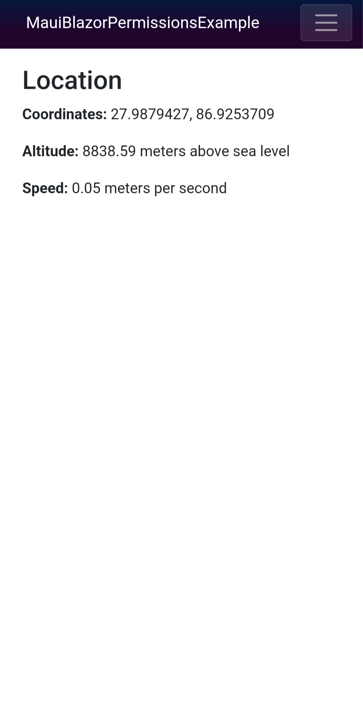
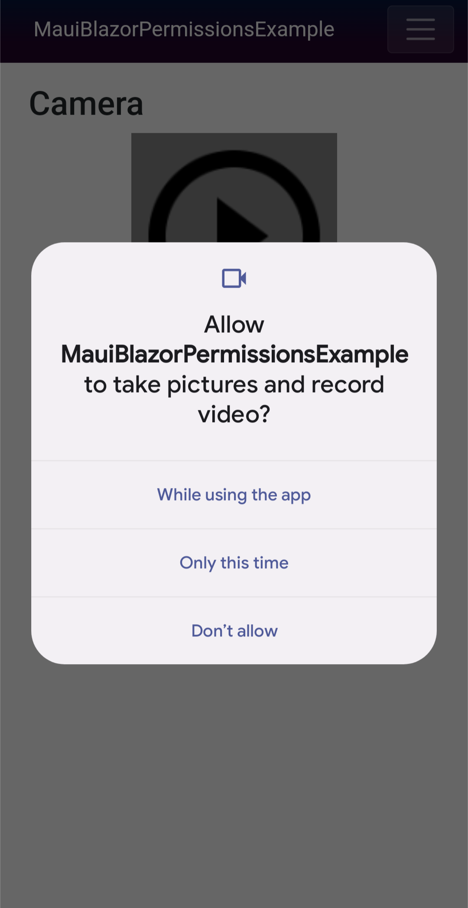

# MAUI Blazor Device Permissions Example

This project demonstrates how to request and manage device permissions in a MAUI Blazor app. Handling permissions requests is a requirement for accessing APIs that rely on certain device features (location, camera, microphone, etc.).

    
    

## Project structure

`MainPage.xaml.cs` registers handlers for `BlazorWebView.BlazorWebViewInitializing` and `BlazorWebView.BlazorWebViewInitialized`. These events are used to perform platform-specific WebView configuration, so this project uses them to enable web APIs that are restricted by default. The event handlers are defined in `MainPage.xaml.Windows.cs` for Windows, `MainPage.xaml.Android.cs` for Android, and `MainPage.xaml.iOS.cs` for iOS/Mac Catalyst.

Additional platform-specific permission management code and configuration files live in the `Platforms/` folders.

The rest is fairly standard, with pages in the `Pages/` folder and JavaScript in `wwwroot/js/`.

## Adding supported device permissions

This example app demonstrates accessing the device's location, camera, and microphone from JavaScript web APIs, but you can easily add more supported permissions to fit the needs of your app. The following sections describe the steps necessary to support additional types of permissions on each platform.

### Windows

App capabilities are listed in `Package.appxmanifest`. The .NET MAUI Blazor App project template includes the capability `"runFullTrust"` so individual capabilities do not need to be listed manually. See [the official docs](https://docs.microsoft.com/en-us/windows/uwp/packaging/app-capability-declarations) for more information about app capability declarations.

### Android

Permissions and features required by the app are defined in `AndroidManifest.xml`. See [the official docs](https://developer.android.com/guide/topics/manifest/manifest-intro) to learn about the Android App Manifest.

Certain Android device permissions require a prompt to be shown at runtime so the user can grant or deny the permission. Android has a recommended [workflow](https://developer.android.com/guide/topics/permissions/overview#workflow) for requesting permissions at runtime, and this workflow must be implemented by the app manually. The WebView's `WebChromeClient` is responsible for reacting to permission requests, so this project provides a `PermissionManagingBlazorWebChromeClient` that maps Webkit resources to Android permissions and executes the recommended workflow for requesting permissions.

After adding additional permissions to `AndroidManifest.xml`, be sure to update `PermissionManagingBlazorWebChromeClient.cs` to include a "rationale string" for that permission explaining why it is needed by the app. It may also be necessary to define additional mappings between [permission request types](https://developer.android.com/reference/android/webkit/PermissionRequest) and Android Manifest permissions.

### iOS

iOS device permissions are defined by adding entries in `Info.plist` containing descriptions justifying why each permission is necessary. See [NSLocationWhenInUseUsageDescription](https://developer.apple.com/documentation/bundleresources/information_property_list/nslocationwheninuseusagedescription) as an example.

## Other notes

The Windows implementation of this project supports two possible behaviors for permission management:
* Automatically grant all permission requests originating from the app origin, denying everything else
* Display a dialog when previously-ungranted permissions are being requested, allowing the user to decide whether to grant or deny

These two behaviors can be toggled using the `HANDLE_WEBVIEW2_PERMISSIONS_SILENTLY` constant, which is defined in `MauiBlazorPermissionsExample.csproj`.
